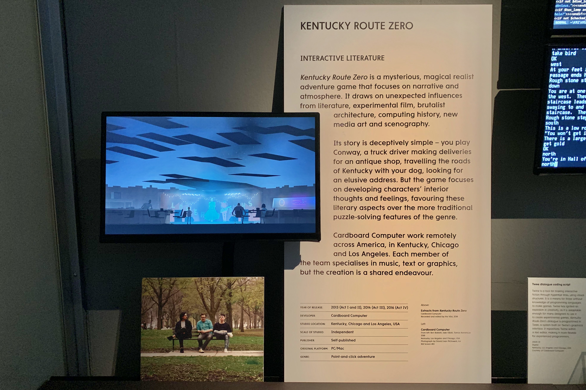

# Kentucky Route Zero Official Developer Wiki

This repo contains the official developer wiki for Kentucky Route Zero.

It was an interactive display as part of the [`Videogames: Design/Play/Disrupt`](https://www.vam.ac.uk/exhibitions/videogames) exhibition at Victoria and Albert Museum in London, ran from 8 September 2018 to 24 February 2019. I simply took photos of all the pages during my visit.

## Artwork Description

> Writing Wiki 
> 
> The three members that make up the studio Cardboard Computer are based in different parts of America. They work remotely and use tools such as this shared wiki to keep track of developments relating to the plot and other elements of the game. The wiki is simple to edit and uses hyperlinks to associate specific references, making it easy to navigate. 
> 
> 2014
> 
> Digital
> 
> Kentucky, Los Angeles and Chicago, USA
> 
> Courtesy of Cardboard Computer

## Spoiler alert!

This wiki features spoilers from Act 1 to Act 4. (Act 5 was unreleased at the time)

It contains what can be considered official interpretations of themes and plot points in the game, as well as detailed narrative summary, character design notes, overworld design notes, character developments, GDC talk notes, and countless fascinating tidbits.

## Download

[Click me](https://github.com/dekuNukem/Kentucky_Route_Zero_Official_Dev_Wiki/archive/master.zip) to download the photo album. (102 photos 140MB)

Sort by name for the correct order.

## Credits

Game belongs to Cardboard Computer

Photo credit: dekuNukem

Feel free to use the photos, but please credit me.

## Questions or Comments?

You can [open an issue](https://github.com/dekuNukem/Kentucky_Route_Zero_Official_Dev_Wiki/issues) or email me at `dekunukem gmail com` for inquires.
