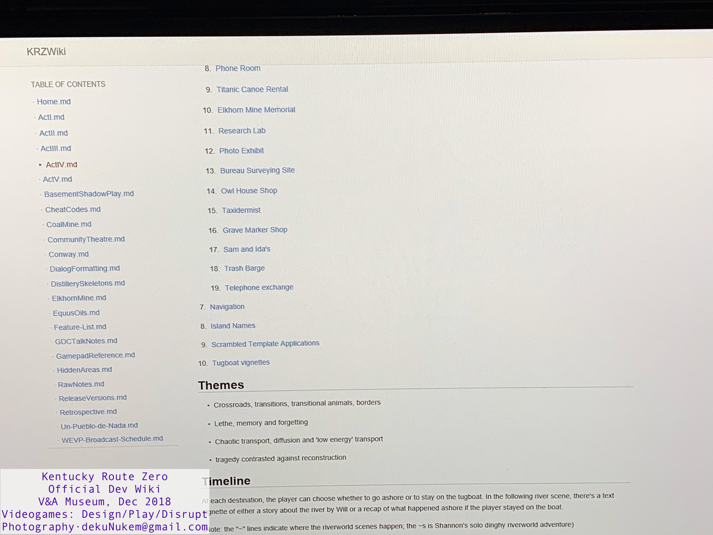
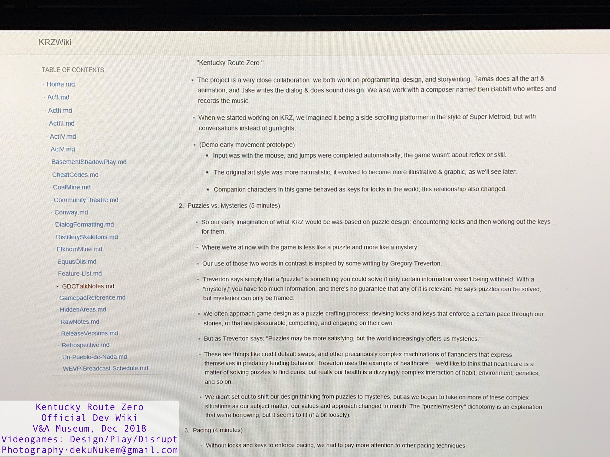
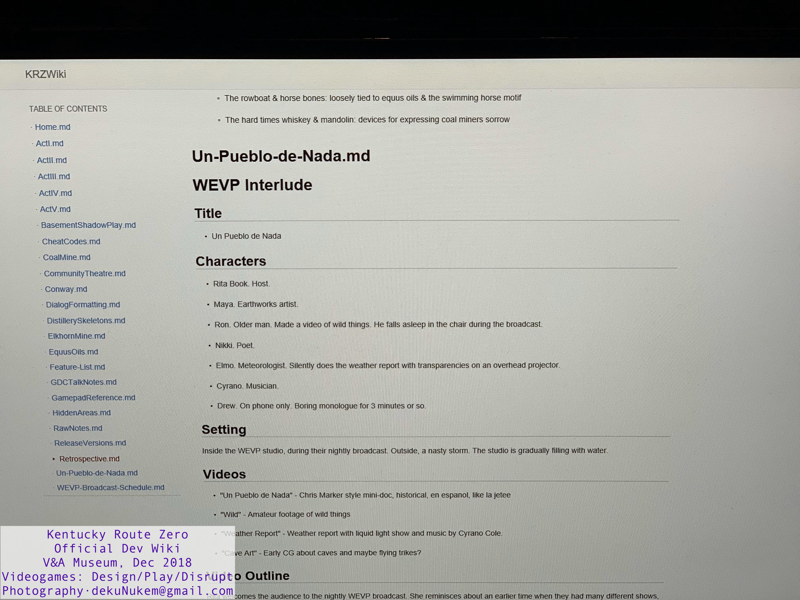

# Kentucky Route Zero Official Developer Wiki

This repo contains the photos of official developer wiki for Kentucky Route Zero.

It was an interactive display as part of the [`Videogames: Design/Play/Disrupt`](https://www.vam.ac.uk/exhibitions/videogames) exhibition at Victoria and Albert Museum in London.

The exhibition ran from 8 September 2018 to 24 February 2019.

## Spoiler alert!

This wiki features...

* Spoilers from Act 1 to Act 4 (Act 5 was unreleased at the time)

* Official interpretations of themes and plot points

* Detailed narrative summary

* Character and overworld design notes

* Sources of inspiration

* Cut content: Scrapped scenes, locations, plot lines, etc.

* GDC talk notes

* Countless fascinating and behind-the-scene tidbits!

## Credits

Game belongs to Cardboard Computer

Photo credit: dekuNukem 

Feel free to use the photos, but please credit me.

## Content

Scroll down to see the photos, or [click me](https://github.com/dekuNukem/Kentucky_Route_Zero_Official_Dev_Wiki/archive/master.zip) to download the entire album (102 photos 140MB). Sort by name for the correct order.

0↓

1↓

2↓

3↓

4↓

5↓

6↓

7↓

8↓

9↓

10↓

11↓

12↓

13↓

14↓

15↓

16↓

17↓

18↓

19↓

20↓

21↓

22↓

23↓

24↓

25↓

26↓

27↓

28↓

29↓

30↓

31↓

32↓

33↓

34↓

35↓

36↓

37↓

38↓

39↓

40↓

41↓

42↓

43↓

44↓

45↓

46↓

47↓

48↓

49↓

50↓

51↓

52↓

53↓

54↓

55↓

56↓

57↓

58↓

59↓

60↓

61↓

62↓

63↓

64↓

65↓

66↓

67↓

68↓

69↓

70↓

71↓

72↓

73↓

74↓

75↓

76↓

77↓

78↓

79↓

80↓

81↓

82↓

83↓

84↓

85↓

86↓

87↓

88↓

89↓

90↓

91↓

92↓

93↓

94↓

95↓

96↓

97↓

98↓

99↓

100↓

101↓

## Questions or Comments?

You can [open an issue](https://github.com/dekuNukem/Kentucky_Route_Zero_Official_Dev_Wiki/issues) or email me at `dekunukem gmail com` for inquires.
